# Mermaid Diagrams

Mermaid is a JavaScript-based diagramming tool that renders Markdown-inspired text definitions to create diagrams dynamically. It's already integrated into your documentation portal!

## Flowchart

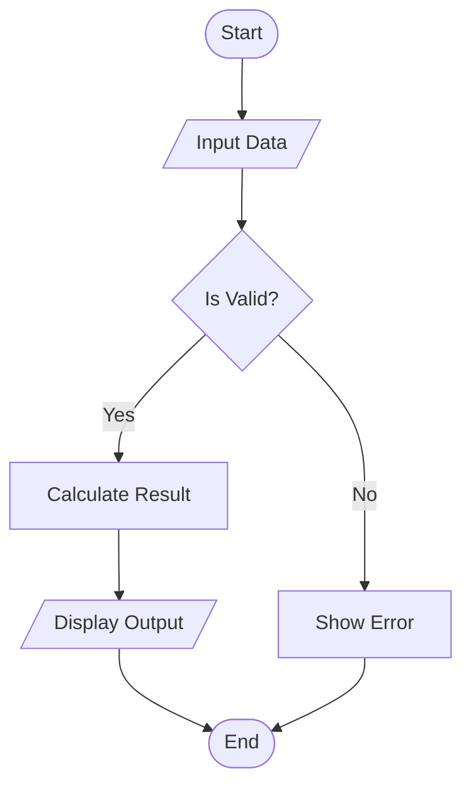

## Sequence Diagram

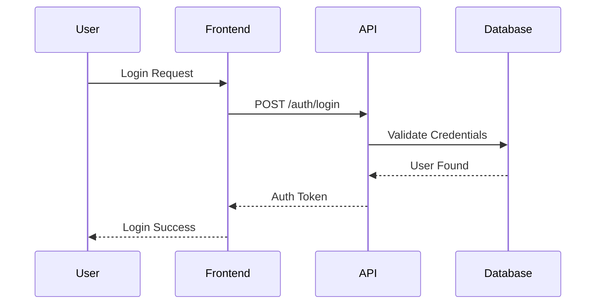

## Class Diagram

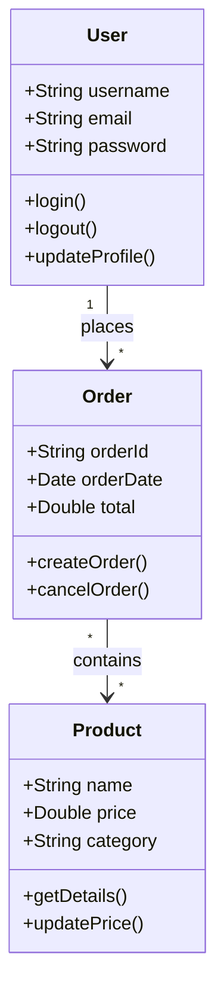

## State Diagram

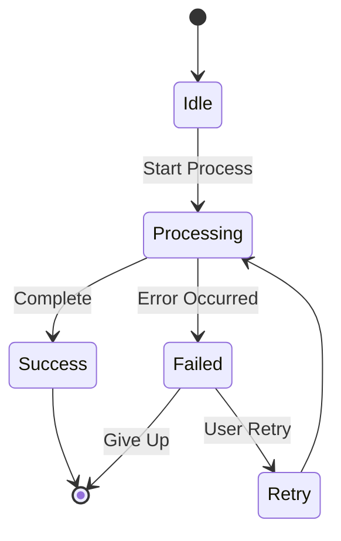

## Entity Relationship Diagram

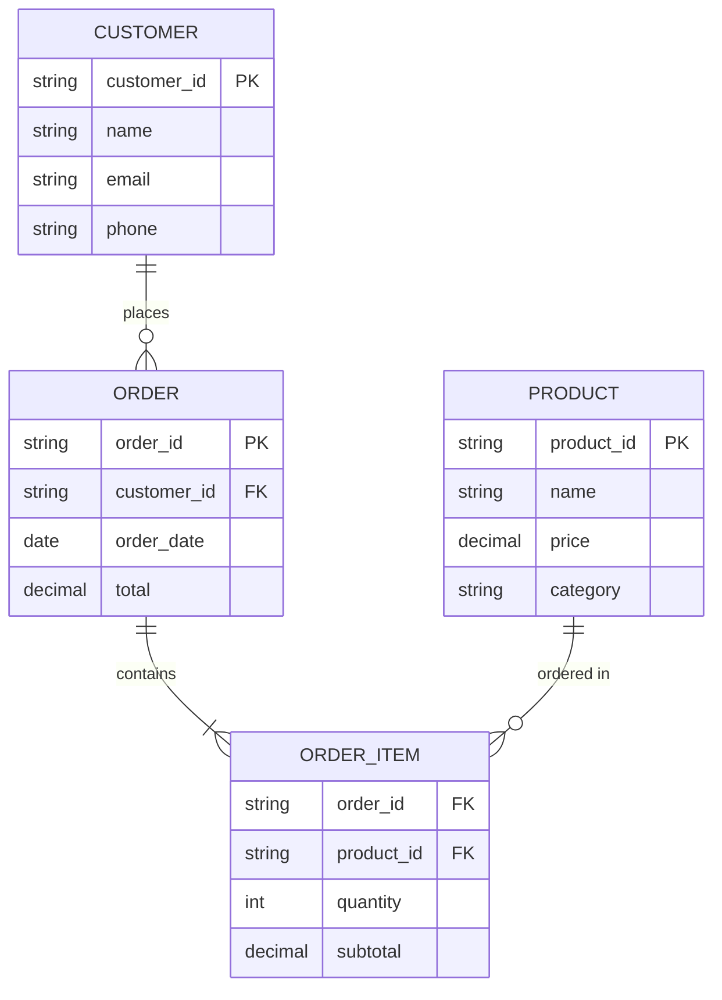

## Gantt Chart

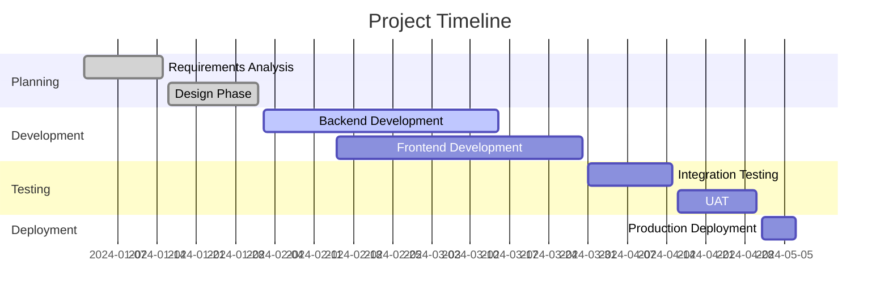

## Pie Chart

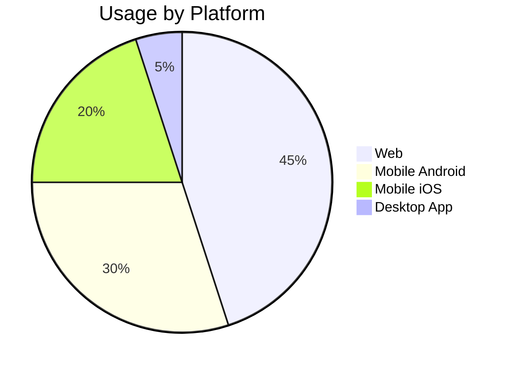

## Git Graph

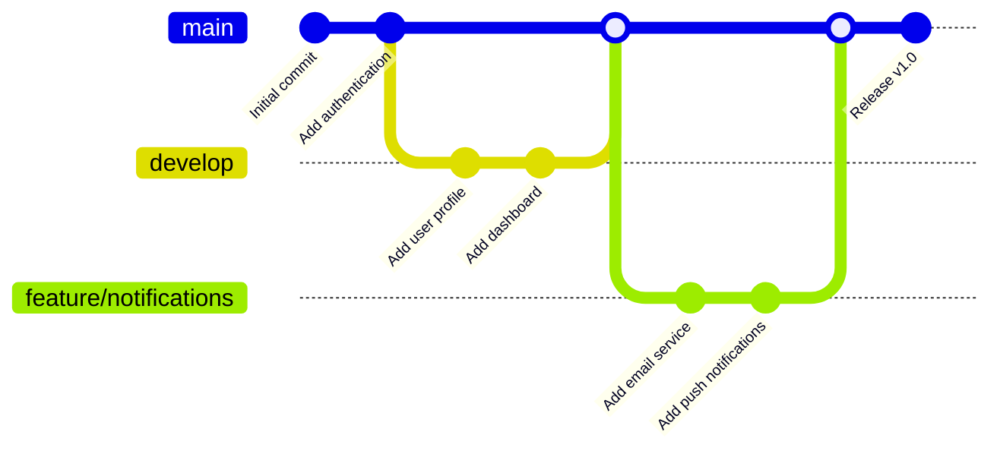

## Journey Diagram

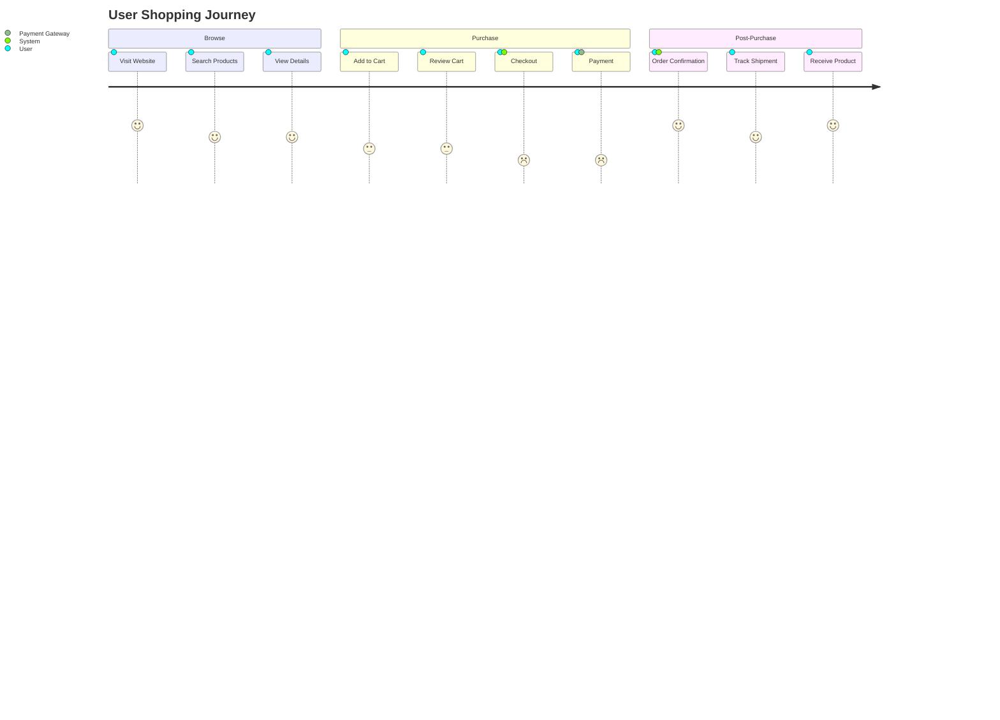

## Mindmap

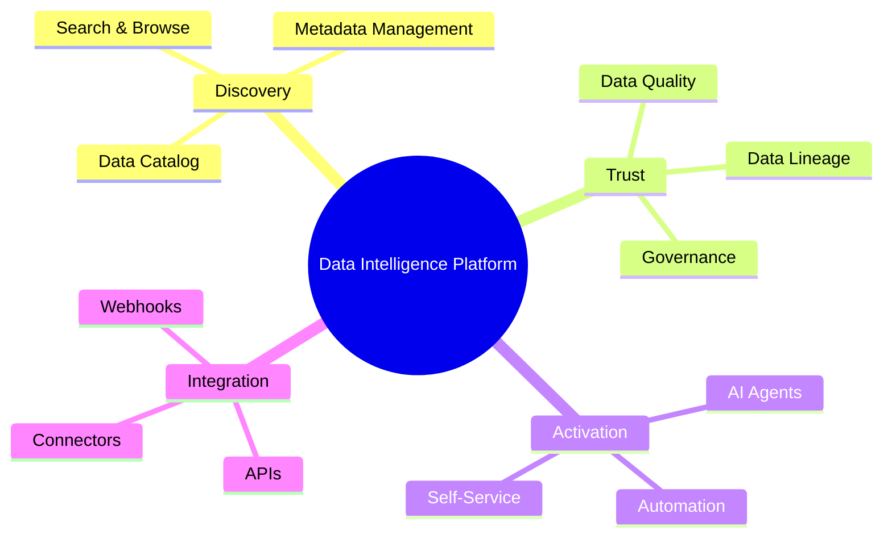

## Timeline

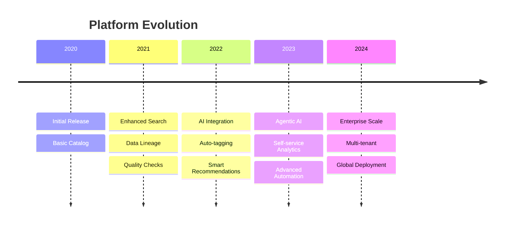

## Quadrant Chart

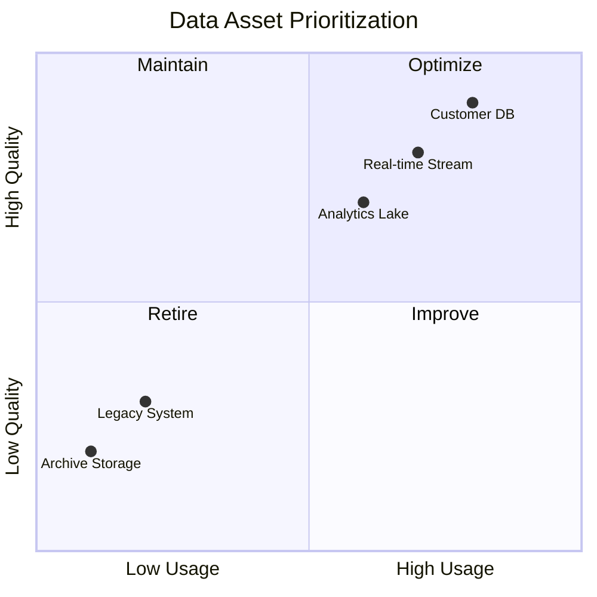

## Syntax Tips

- Wrap Mermaid code in triple backticks with `mermaid` language identifier
- Use different diagram types by starting with keywords like `flowchart`, `sequenceDiagram`, `classDiagram`, etc.
- Mermaid renders directly in the browser using JavaScript
- For detailed syntax, visit the [official Mermaid documentation](https://mermaid.js.org/)

## Comparison: Mermaid vs PlantUML

| Feature | Mermaid | PlantUML |
|---------|---------|----------|
| Rendering | Client-side (JavaScript) | Server-side (Image) |
| Performance | Fast, no server needed | Requires external server |
| Diagram Types | 15+ types | 20+ types |
| Best For | Interactive docs, web | Complex enterprise diagrams |
| Customization | CSS-based | PlantUML themes |
