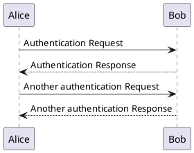
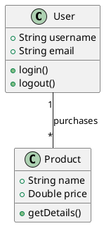
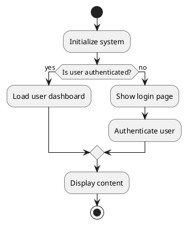
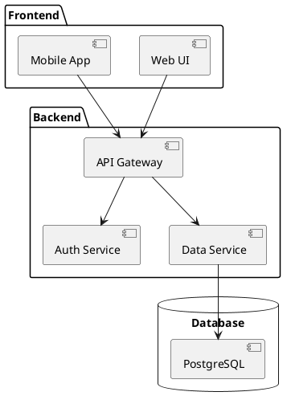
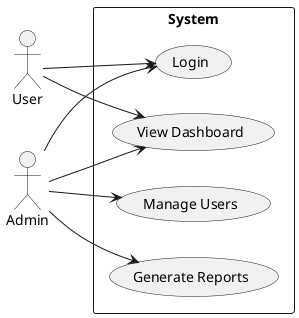
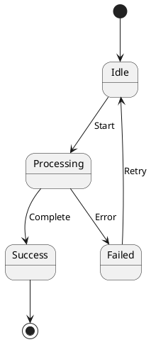

# PlantUML Examples

PlantUML is now integrated into your documentation portal! You can create various types of diagrams using simple text syntax.

## Sequence Diagram

## Class Diagram

## Activity Diagram

## Component Diagram

## Use Case Diagram

## State Diagram

## Syntax Reference

- Wrap PlantUML code in triple backticks with `plantuml` language identifier
- Start diagrams with `@startuml` and end with `@enduml`
- Use arrows (`->`, `-->`, `<--`) for relationships
- Use `:` for labels and descriptions
- Use `|`, `{`, `}` for grouping and organization

For more PlantUML syntax examples, visit the [official PlantUML documentation](https://plantuml.com/).
