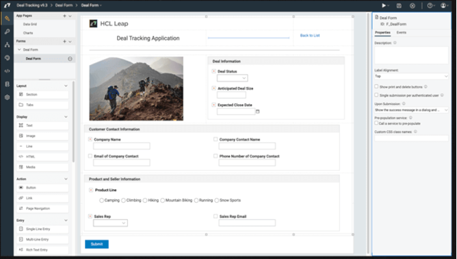
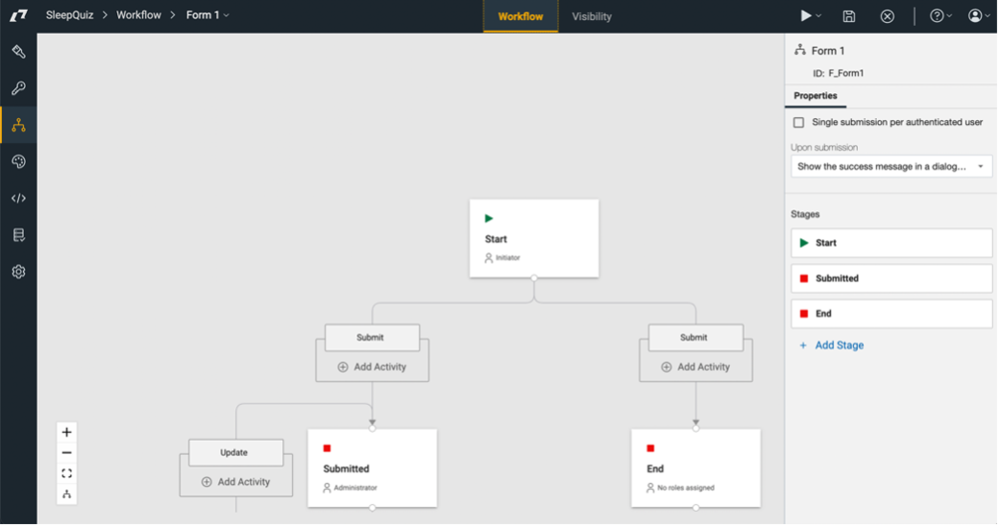

---
tags:
    - LEAP
    - Forms
    - Forms Builder
---

# Form application builder

Actian DX provides Actian LEAP product. With Actian LEAP, business users can create and deploy customer engagement applications and forms. Customers use Actian LEAP to build applications like Issue and resolution tracking, Customer change requests, Supply chain certification, Healthcare tracking, Business requests, Customer acquisition, and Employee onboarding.

## Forms builder

With Actian Leap, non-technical users can create sophisticated web applications for data collection and process automation. Users design applications without writing code through a simple drag-and-drop interface. More technical users can extend the application further by including custom JavaScript actions, for example. Styles can be modified through CSS, functions added as HTML fragments, and JavaScript can be used with the software’s comprehensive API and events.

Integrate data from existing systems to pre-populate fields and feed back-end systems with information you collect. With Actian LEAP's service architecture, you can define connections with most back-end services, including services created by using Actian Volt MX Foundry.

When you deploy your application, Actian Leap automatically creates its runtime environment, which includes forms, a database, reports, charts, an API, rules, notifications, security, and workflow.

User can build an application with drag-and-drop actions:

## Integrated workflow

Actian LEAP also includes a flexible, role-based workflow and access control. You can automatically generate email notifications, invoke services at workflow steps, and provide a dynamic experience based on rules. The lifecycle of Forms can also be controlled with different access permissions at each stage. With this access control, you can automate simple processes with Actian LEAP.

